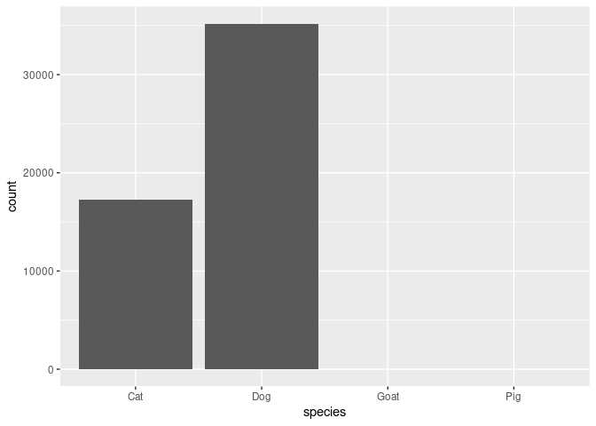
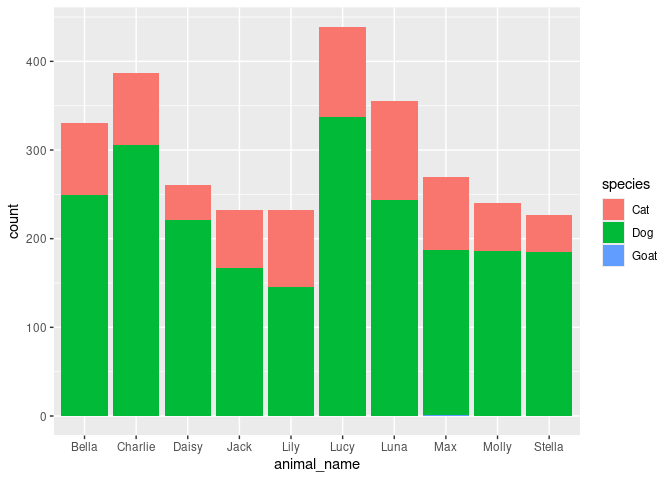

DSC 200 Lab Project -Term 2232
================
2024-05-19

**Student Name:<Al_Shaya_Almasar>**

**Student ID:\<insert 2210002236\>**

**Deadline:** 23:59 on Sunday, 19 May 2024

**Total Points:** 20

## Loading Packages

``` r
library(tidyverse)
library(openintro)
library(ggrepel)
```

## Tasks

\`1. (2 points)

``` r
 seattlepets %>%
distinct (species)
```

    ## # A tibble: 4 × 1
    ##   species
    ##   <chr>  
    ## 1 Dog    
    ## 2 Cat    
    ## 3 Goat   
    ## 4 Pig

Write your narrative here

\`2. (2 points)

``` r
seattlepets %>%
  ncol()
```

    ## [1] 7

Write your narrative below

\`3. (2 points)

``` r
seattlepets %>%
select (species) %>%
  count(species , sort = TRUE)
```

    ## # A tibble: 4 × 2
    ##   species     n
    ##   <chr>   <int>
    ## 1 Dog     35181
    ## 2 Cat     17294
    ## 3 Goat       38
    ## 4 Pig         6

Write your narrative here

\`4. (2 points)

``` r
seattlepets %>% 
  select(animal_name) %>%
  count(animal_name , sort = TRUE)
```

    ## # A tibble: 13,930 × 2
    ##    animal_name     n
    ##    <chr>       <int>
    ##  1 <NA>          483
    ##  2 Lucy          439
    ##  3 Charlie       387
    ##  4 Luna          355
    ##  5 Bella         331
    ##  6 Max           270
    ##  7 Daisy         261
    ##  8 Molly         240
    ##  9 Jack          232
    ## 10 Lily          232
    ## # ℹ 13,920 more rows

Write your narrative here

\`5. (2 points)

``` r
seattlepets %>%
filter(species == "Pig") %>%
  arrange(animal_name)
```

    ## # A tibble: 6 × 7
    ##   license_issue_date license_number animal_name species primary_breed
    ##   <date>             <chr>          <chr>       <chr>   <chr>        
    ## 1 2018-04-23         S116433        Atticus     Pig     Pot-Bellied  
    ## 2 2018-08-29         S146305        Coconut     Pig     Pot-Bellied  
    ## 3 2018-04-10         139975         Darla       Pig     Pot Bellied  
    ## 4 2018-07-27         731834         Millie      Pig     Pot-Bellied  
    ## 5 2018-08-29         S146306        Othello     Pig     Pot-Bellied  
    ## 6 2018-05-12         S141788        <NA>        Pig     Standard     
    ## # ℹ 2 more variables: secondary_breed <chr>, zip_code <chr>

Write your narrative here

\`6. (2 points)

``` r
seattlepets %>%
  filter(species == "Goat") %>%
  select(animal_name , primary_breed) %>%
  arrange(animal_name)
```

    ## # A tibble: 38 × 2
    ##    animal_name     primary_breed
    ##    <chr>           <chr>        
    ##  1 Abelard         Miniature    
    ##  2 Aggie           Miniature    
    ##  3 Arya            Miniature    
    ##  4 Beans           Miniature    
    ##  5 Brussels Sprout Miniature    
    ##  6 Darcy           Miniature    
    ##  7 Fawn            Miniature    
    ##  8 Fiona           Miniature    
    ##  9 Gavin           Standard     
    ## 10 Grace           Miniature    
    ## # ℹ 28 more rows

Write your narrative here

\`7. (2 points)

``` r
seattlepets %>%
  mutate(pet = animal_name , species) %>%
  select(license_number , pet) %>%
  arrange(pet)
```

    ## # A tibble: 52,519 × 2
    ##    license_number pet                               
    ##    <chr>          <chr>                             
    ##  1 8001665        "\"Luci\" Lucia Rosalin Wicksugal"
    ##  2 896557         "\"Mama\" Maya"                   
    ##  3 S147119        "\"Mo\""                          
    ##  4 353597         "'Alani"                          
    ##  5 S143106        "'Murca"                          
    ##  6 573722         "-"                               
    ##  7 S126229        "1"                               
    ##  8 S126230        "2"                               
    ##  9 133239         "30 Weight"                       
    ## 10 S142492        "7's"                             
    ## # ℹ 52,509 more rows

Write your narrative here

\`8. (2 points)

``` r
ggplot(seattlepets,aes(x=species))+
  geom_bar();
```

<!-- --> Write
your narrative here

\`9. (2 points)

``` r
top_10_names <- seattlepets %>% 
filter(animal_name %in% c( "Lucy"  , "Charlie" , "Luna" , "Bella" , "Max"    , 
                           "Daisy" , "Molly"   , "Jack" , "Lily"  , "Stella" ))
top_10_names
```

    ## # A tibble: 2,974 × 7
    ##    license_issue_date license_number animal_name species primary_breed          
    ##    <date>             <chr>          <chr>       <chr>   <chr>                  
    ##  1 2018-11-25         S120480        Charlie     Dog     Retriever, Labrador    
    ##  2 2018-11-03         829563         Max         Dog     Retriever, Labrador    
    ##  3 2018-10-29         732106         Lily        Cat     Domestic Shorthair     
    ##  4 2018-11-25         895808         Max         Cat     Domestic Shorthair     
    ##  5 2018-11-26         834841         Daisy       Dog     Terrier, American Pit …
    ##  6 2018-12-13         8003804        Charlie     Dog     Border Collie          
    ##  7 2018-11-06         S125292        Jack        Cat     Domestic Shorthair     
    ##  8 2018-11-01         835179         Stella      Dog     Retriever, Labrador    
    ##  9 2018-12-14         950094         Molly       Dog     Retriever, Labrador    
    ## 10 2018-11-24         S137301        Lucy        Dog     Hound                  
    ## # ℹ 2,964 more rows
    ## # ℹ 2 more variables: secondary_breed <chr>, zip_code <chr>

\`a. What does the above code chunk do? The code performs the following
actions:

1.  **Selecting Popular Pet Names:**
    - It filters the `animal_name` column in the `seattlepets` data
      frame to include only rows where the pet’s name is one of the
      specified names: (“Lucy”, “Charlie”, “Luna”, “Bella”, “Max”,
      “Daisy”, “Molly”, “Jack”, “Lily”, “Stella”).
2.  **Creating a New Data Frame:**
    - The filtered result is stored in a new data frame called
      `top_10_names`.

In summary, the code filters the `seattlepets` data frame to include
only the rows with the ten specified pet names and stores this filtered
data in `top_10_names`.

\`b. Plot the counts of the pet names (animal_name) in top_10_names

``` r
seattlepets %>%
  filter(animal_name %in% c( "Lucy"  , "Charlie" , "Luna" , "Bella" , "Max"    , 
                           "Daisy" , "Molly"   , "Jack" , "Lily"  , "Stella" )) %>%
  ggplot(aes(animal_name , 
             fill = species)) + 
  geom_bar()
```

<!-- -->

\`10. (2 points)

\`The below code plots the proportion of dogs with a given name versus
the proportion of cats with the same name. The 20 most common cat and
dog names are displayed. The diagonal line on the plot is the x = y
line; if a name appeared on this line, the name’s popularity would be
exactly the same for dogs and cats.

    ## Warning: Using `size` aesthetic for lines was deprecated in ggplot2 3.4.0.
    ## ℹ Please use `linewidth` instead.
    ## This warning is displayed once every 8 hours.
    ## Call `lifecycle::last_lifecycle_warnings()` to see where this warning was
    ## generated.

    ## Warning in geom_image(mapping, data, inherit.aes = inherit.aes, na.rm = na.rm, : All aesthetics have length 1, but the data has 20 rows.
    ## ℹ Please consider using `annotate()` or provide this layer with data containing
    ##   a single row.
    ## All aesthetics have length 1, but the data has 20 rows.
    ## ℹ Please consider using `annotate()` or provide this layer with data containing
    ##   a single row.

<!-- -->

\`What names are more common for cats than dogs? The ones above the line
or the ones below the line?

\`Answer here………………

\`Is the relationship between the two variables (proportion of cats with
a given name and proportion of dogs with a given name) positive or
negative? What does this mean in context of the data?

\`Answer here ………….
